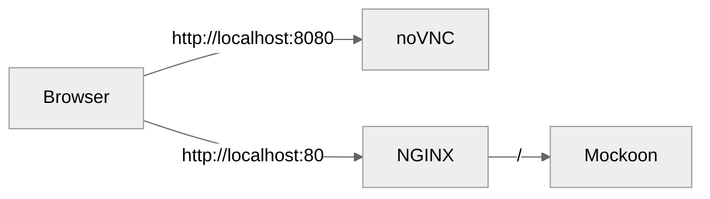

# mockoon-novnc

[](https://opensource.org/licenses/MIT)
[](https://hub.docker.com/r/lasuillard/mockoon-novnc)

Docker image for Mockoon GUI with noVNC.


## ✨ Features

- **Web-based UI** to access Mockoon GUI through noVNC
- **Path-based port forwarding** — route requests like `http://localhost/3000/path/to/mock` to port 3000
- **Header-based port forwarding** — use `X-Port-Forward: 3678` header to target a specific port

## 🚀 How to use

Pull and run the image from [Docker Hub](https://hub.docker.com/r/lasuillard/mockoon-novnc) as follows:

```bash
$ docker run --rm \
    -p 127.0.0.1:3000:3000 \
    -p 127.0.0.1:8080:8080 \
    -p 127.0.0.1:80:80 \
    -e DISPLAY_WIDTH=1024 \
    -e DISPLAY_HEIGHT=768 \
    -e NGINX_PATHPORT=yes \
    lasuillard/mockoon-novnc:main
```

The following endpoints are available (via NGINX):



- http://localhost:3000 for direct Mockoon access
- http://localhost:80/ for Mockoon via NGINX
- http://localhost:80/3000/path/to/mock for path-based port forwarding
- http://localhost:8080 for noVNC web UI

Once the container is up, you can access the noVNC UI at http://localhost:8080. By default, the demo mock API will be available at http://localhost:3000 (or http://localhost:80/3000 if you've enabled NGINX path-based port forwarding).

Test it with the following simple `curl` command:

```bash
$ curl http://localhost:3000/users
[{"id":"054bf92d-cf1f-4c66-8fc9-256a1f41c480","username":"Kaela10"},...]
```

Or, with NGINX path-based port forwarding enabled:

```bash
$ curl http://localhost/3000/users
[{"id":"054bf92d-cf1f-4c66-8fc9-256a1f41c480","username":"Kaela10"},...]
```

### 🔀 Port forwarding

This project uses NGINX to provide path-based and header-based port forwarding features, which are useful when running multiple Mockoon environments without exposing many external ports.

#### Path-based port forwarding

Instead of binding each Mockoon port to the host, send requests like:

    http://localhost/3000/path/to/mock

NGINX forwards this to port 3000 just like `http://localhost:3000/path/to/mock`. If no port is specified in the path, it falls back to port 3000.

> Only ports in the range 3000–3999 will be forwarded; otherwise NGINX responds with **404 Not Found**.

#### Header-based port forwarding

Alternatively, use the `X-Port-Forward` header to specify a target port without modifying the path:

    curl --fail --silent http://localhost --header 'X-Port-Forward: 3678'

> The same port range restriction (3000–3999) applies, and path-based forwarding takes precedence.

### ⚙️ Environment variables

| Key                            | Description                                                                                                                                               |
| ------------------------------ | --------------------------------------------------------------------------------------------------------------------------------------------------------- |
| `DISPLAY_WIDTH`                | noVNC display width. Defaults to `1024`.                                                                                                                |
| `DISPLAY_HEIGHT`               | noVNC display height. Defaults to `768`.                                                                                                                   |
| `NGINX_PATHPORT`               | Enable NGINX path-based and header-based port forwarding. <br/>Set to `"yes"` to enable. Disabled by default.                                             |

### 📂 Mount points

- `/root/.config/mockoon` for Mockoon configuration and storage (persistent)
- `/root/.config/mockoon/storage` for Mockoon environments, including mock API definitions and settings

## ⚠️ Limitations

There are known limitations so far:

- Clipboard may not work properly for some languages due to limitations of noVNC itself, which the base image relies on. See related issue [here](https://github.com/novnc/noVNC/issues/1708).

## 💖 Contributing

Please refer to [CONTRIBUTING.md](./CONTRIBUTING.md) for more information on how to contribute to this project.

## 🙏 Special thanks

This image was previously built on [theasp/novnc](https://github.com/theasp/docker-novnc/).

## 📜 License

This project is licensed under the MIT License.
